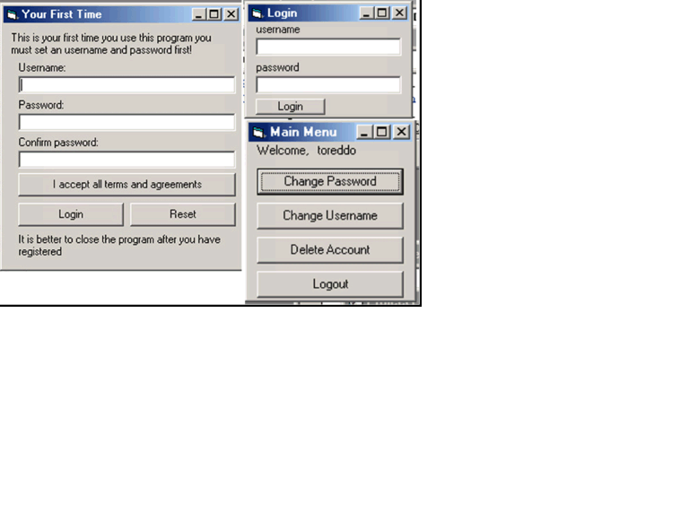

<div align="center">

## Advanced Login Script V1\.0


</div>

### Description

This code allows you to put an Login Structure to youre program (like a diary with login security)

it works with an Microsoft Access Database.

In the next version(s):

- Remember Username and password

- Multi user

If you have more "THINGS" to add let me know :)

I will write the next version on that way you just have to overwrite the forms and it works!

BUT people this is my first program PLEASE VOTE!!
 
### More Info
 


<span>             |<span>
---                |---
**Submitted On**   |2005-05-08 19:31:40
**By**             |[Chris Tolmeijer](https://github.com/Planet-Source-Code/PSCIndex/blob/master/ByAuthor/chris-tolmeijer.md)
**Level**          |Beginner
**User Rating**    |3.8 (23 globes from 6 users)
**Compatibility**  |VB 3\.0, VB 4\.0 \(16\-bit\), VB 4\.0 \(32\-bit\), VB 5\.0, VB 6\.0, VB Script, VBA MS Access
**Category**       |[Miscellaneous](https://github.com/Planet-Source-Code/PSCIndex/blob/master/ByCategory/miscellaneous__1-1.md)
**World**          |[Visual Basic](https://github.com/Planet-Source-Code/PSCIndex/blob/master/ByWorld/visual-basic.md)
**Archive File**   |[Advanced\_L1886535102005\.zip](https://github.com/Planet-Source-Code/chris-tolmeijer-advanced-login-script-v1-0__1-60457/archive/master.zip)

### API Declarations

```
there is a copyright i love if you keep it up, but if you really want delete it then go ahead,
but you know i appreciate it!!
```


